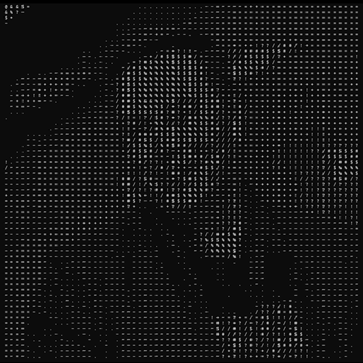

# Ascii art

Source image               |Ascii conversion
:-------------------------:|:-------------------------:
         |

## Description
This is an app to convert an image to ascii art.
- Source image will always be load with GRAY_SCALE flag and resize into 64x64.
- Output contains:
    + A .txt file
    + A .jpg file (in the same directory with `txt_path`)

## Features:
- OpenCV based.
- Source image is in any resolution.

## Run
For black background (Eg: Command line):
```shell
ascii-art -i [img_path] -o [txt_path]
```
For white background (Eg: Notepad):
```shell
ascii-art -i [img_path] -o [txt_path] -r
```
### Eg:
```shell
ascii-art -i in.jpg -o out.txt
```

## Build
### Debug
```shell
cargo build
```
### Release
```shell
cargo build --release
```

## Have not finished
- Width and height adjustion for ascii text.
- Modification for ascii char list encoding.